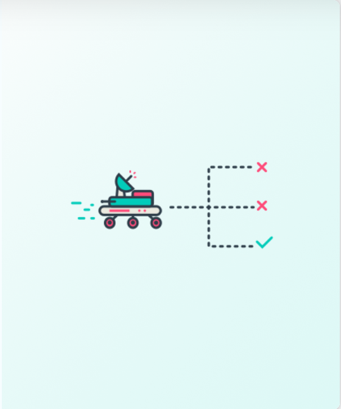
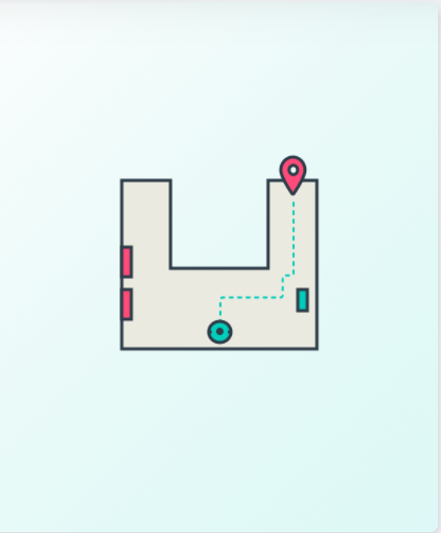

# RoboND Projects

---

<a href='https://github.com/raymondngiam/RoboND-BuildMyWorld'>Build My World</a>

Design a Gazebo world environment by including multiple models and use it as a base for the following projects.

<a href='https://github.com/raymondngiam/RoboND-GoChaseIt'>Go Chase It</a>

Design and build a mobile robot, house it in a simulation world, and program the robot with C++ nodes in ROS to chase white colored balls! 

<a href='https://github.com/raymondngiam/RoboND-WhereAmI'>Where Am I</a>

Use the Adaptive Monte Carlo Localization algorithm in ROS to localize a robot!

<a href='https://github.com/raymondngiam/RoboND-MapMyWorld'>Map My World</a>

Deploy RTAB-Map on a simulated robot to create 2D and 3D maps of a virtual environment.

<a href='https://github.com/raymondngiam/RoboND-HomeServiceRobot'>Home Service Robot</a>

Program a home service robot that will autonomously map an environment and navigate to pickup and deliver objects!

